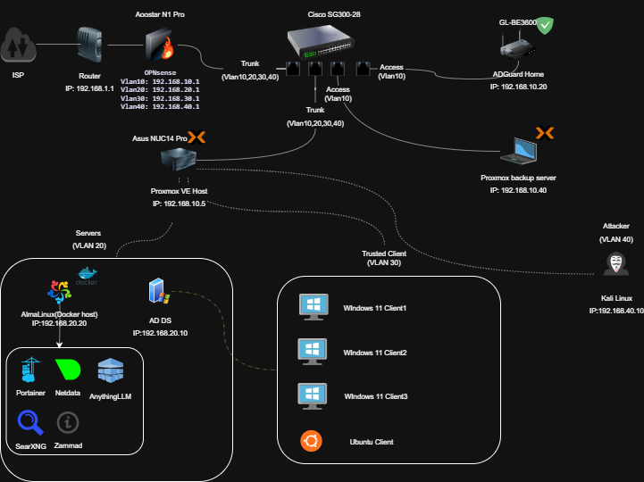

# Proxmox OPNsense Vlan Homelab (2025)

A isolated, VLAN-segmented enterprise-style network lab built with production-like security practices. Designed to refresh and extend skills in networking, system administration, cybersecurity, and IT support.

**GitHub:** https://github.com/jack9789/proxmox-opnsense-vlan-lab
**Author:** Sheng-You Chen (Adelaide, Australia)

## Overview Diagram

*(High-resolution topology diagram showing ISP → OPNsense → Cisco SG300 switch → Proxmox host and VMs across VLANs 10, 20, 30, 40)*

## Goals
- Demonstrate hands-on experience with modern infrastructure tools (Proxmox VE, OPNsense, Cisco switching, Active Directory).
- Practice secure network segmentation using 802.1Q VLANs and firewall policies.
- Build and manage a multi-VLAN Active Directory environment.
- Simulate real-world IT support and cybersecurity scenarios.
- Document configurations for portfolio and resume use.

## Hardware
- **Proxmox Host**: ASUS NUC14 Pro (single NIC)
- **Firewall/Router**: OPNsense on dedicated AOOSTAR N150 mini PC (2 NICs)
- **Switch**: Cisco SG300-28 (managed, Layer 2+ with 802.1Q support)
- **ISP Router**: Home modem/router (double-NAT for full lab isolation)

## Network Design

| VLAN | Purpose           | Subnet              | Key Devices / VMs                                      |
|------|-------------------|---------------------|--------------------------------------------------------|
| 10   | Management        | 192.168.10.0/24    | Proxmox host (192.168.10.5) OPNsense (192.168.10.1) |
| 20   | Servers           | 192.168.20.0/24    | Windows Server 2022 AD DC (192.168.20.10) AlmaLinux Docker host (192.168.20.20) – Portainer, Nextcloud, Zammad, SearXNG, etc. |
| 30   | Trusted Clients   | 192.168.30.0/24    | Windows 11 clients (DHCP from OPNsense) Ubuntu desktop client (DHCP) |
| 40   | Attacker / DMZ    | 192.168.40.0/24    | Kali Linux (192.168.40.10 – static)                    |

- **Trunk ports** on Cisco SG300 carry tagged VLANs 10, 20, 30, 40 to both OPNsense and Proxmox.
- **Double-NAT isolation**: Lab sits behind home ISP router – zero impact on daily devices.
- **Inter-VLAN routing & firewalling** handled by OPNsense with strict rules (e.g., block Attacker → Servers by default).

## Key Features & Services
- **Virtualization**: Proxmox VE – VMs and LXCs across VLANs
- **Directory Services**: Active Directory Domain Controller (DNS, DHCP scopes for trusted VLANs, GPOs)
- **Docker Services** (on AlmaLinux host):
  - Portainer (management)
  - Nextcloud (file sync)
  - Zammad (helpdesk ticketing)
  - SearXNG (private search)
  - Nginx Proxy Manager (reverse proxy + Let's Encrypt SSL)
- **Security**:
  - Suricata IDS/IPS & Zenarmor on OPNsense
  - Strict firewall rules between VLANs
  - Isolated attacker VLAN for safe testing
- **Monitoring & Backup**: Proxmox Backup Server (planned/in progress)

## Skills Demonstrated
- Cisco IOS VLAN/trunk configuration
- OPNsense VLAN sub-interfaces, DHCP relay, firewall rules
- Proxmox single-NIC VLAN-aware bridge setup
- Windows Server AD DS, DNS, DHCP, multi-subnet management
- Linux system administration (AlmaLinux, Ubuntu domain join via SSSD)
- Docker container deployment and management
- Reverse proxy with TLS termination
- Network troubleshooting across segmented environment

## Documentation
- Sanitized configuration exports (OPNsense config.xml, Cisco running-config, Proxmox network interfaces)
- Topology diagram (draw.io source included)
- Screenshots of key setups (AD joins, Suricata alerts, etc.)

## Future Plans
- Add Proxmox Backup Server in VLAN 10
- Implement Guacamole for browser-based remote desktop (IT support simulation)
- Deploy GLPI ticketing alongside Zammad
- More advanced GPOs and monitoring (Grafana/Prometheus)

---

**This project is actively maintained and used for continuous learning.**  
Feel free to fork, star, or reach out for questions!

Sheng-You Chen  
Adelaide, South Australia  
jack9789@gmail.com
